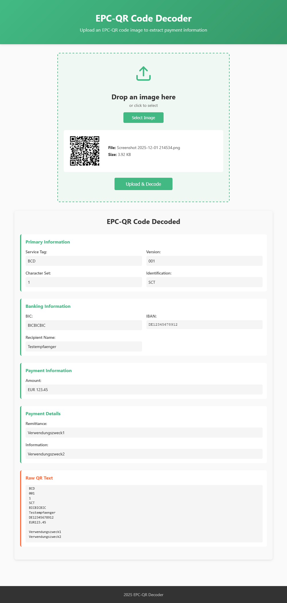

# GiroDecoder

This project is a web app, that takes images of GiroCode QR codes (EPC-QR codes) and displays the information in a structured way. 
The backend is made with Spring Boot 4.
The frontend uses vite and vue 3.

The code was completely done with vibe coding using Claude in VS Code.


## backend

to run the backend, first go to the backend folder

```bat 
cd backend
```

just run in backend folder

```bat 
mvn spring-boot:run
```

## frontend

to run the frontend, first go to the frontend folder

```bat
cd frontend
```

install packages

```bat
npm install
```

just run in frontend folder

```bat
npm run dev
```


## how the app looks

